### preface
UBC aerodesign is an engineering student design team that competes in the SAE AeroDesign competition. my main focus was on the Advanced Class competition, where i was the avionics director, meaning i oversaw the engineering of every thing electronics or software related. 

although i've done a fair share of technical work, my main contributions have been as a system architecture, technical lead, and project manager. i grew the team from around 5 people to nearly 30 over 3 years. when i joined the team we were using an arduino nano, hand soldered protoboards, and an android phone to do everything. the most sophisticated software was a PDE solver to estimate glider landing positions. 

nowadays we design and build our own custom data collection pcbs controlled using STM32 chips and our own power electronics, we've implemented sophisticated long range image and data transfer, and are experimenting with SDR. on the ground we've expanded our software to include modern webdev stacks, built responsive QT GUIs, and have developped various computer vision algorithms that incorporate machine learning. this increase in system complexity can be visualized in our system block diagrams:

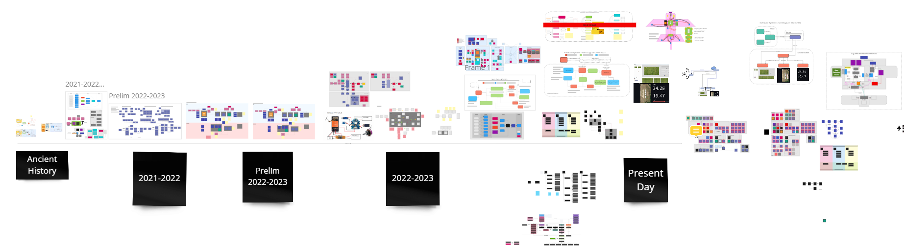

These are shown in full in the next few sectinons:
### 2020 system diagram
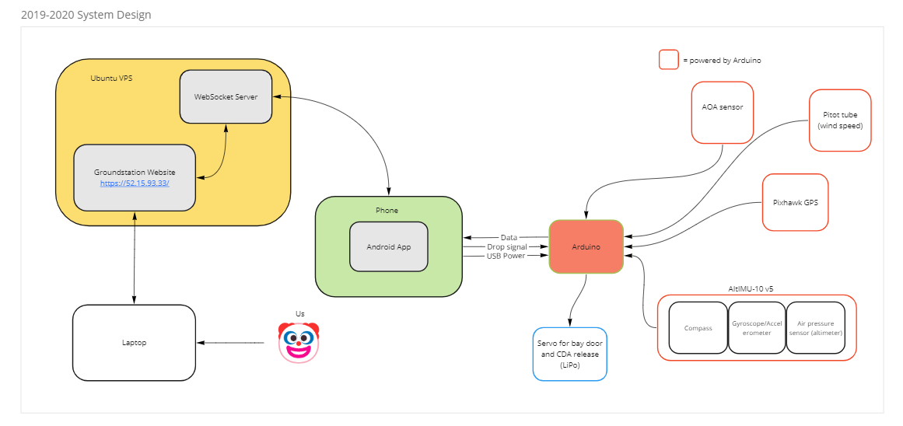

### 2021 system diagram
this was the year i officially became lead, and had to redesign the entire system to meet our new ruleset
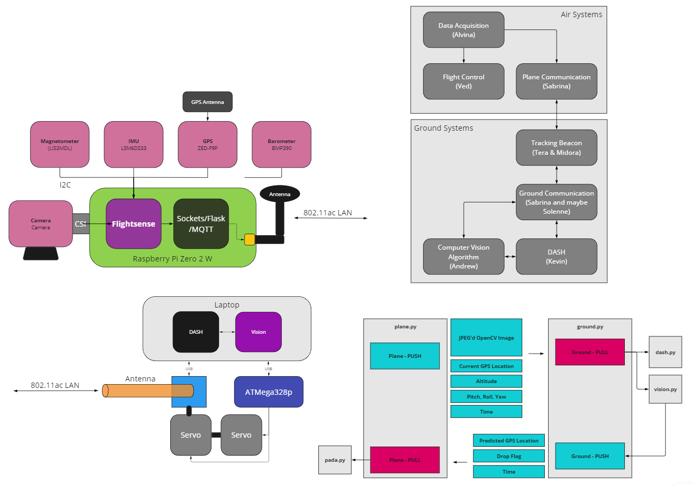

### 2022 system diagram
if you care, you can read my design report [here](https://docs.google.com/document/d/1vLW5fpvkG754h425S2lcKjFMK5De6ywy3ep6ixqs3A4/edit) 
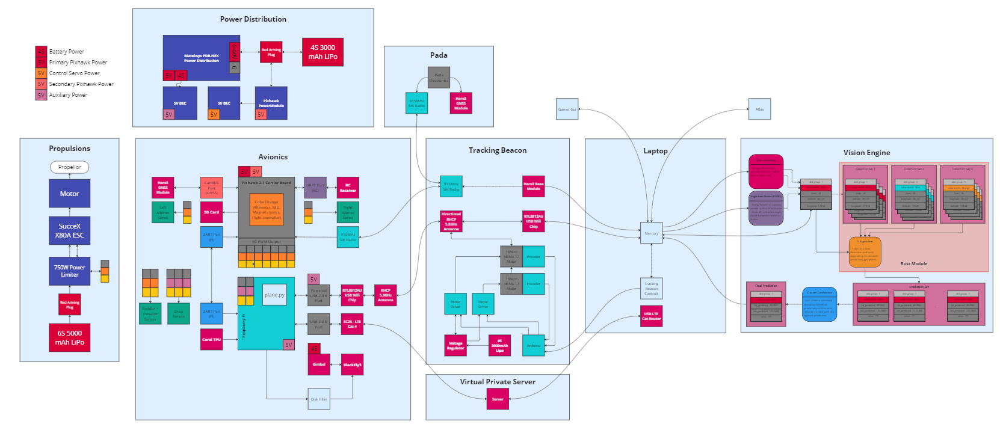
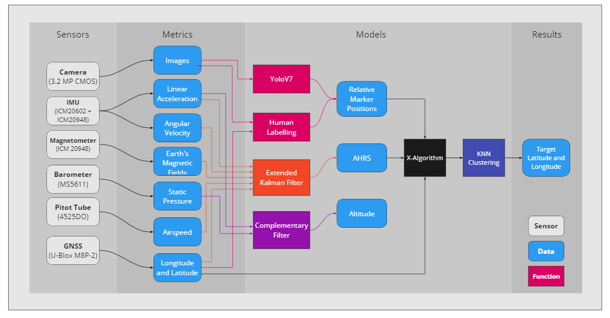

### 2023 system diagram
at the time of writing this, we are just beginning the 2023 design cycle. exciting things to come :) 
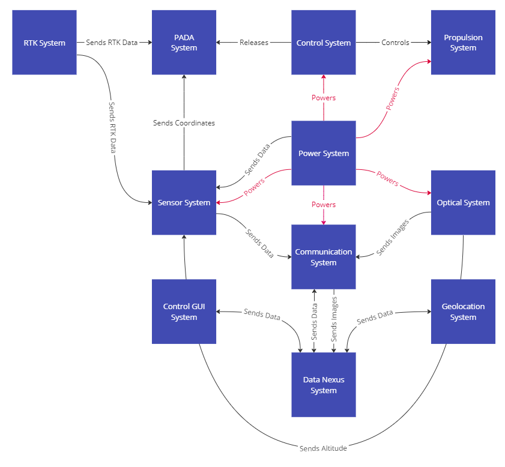
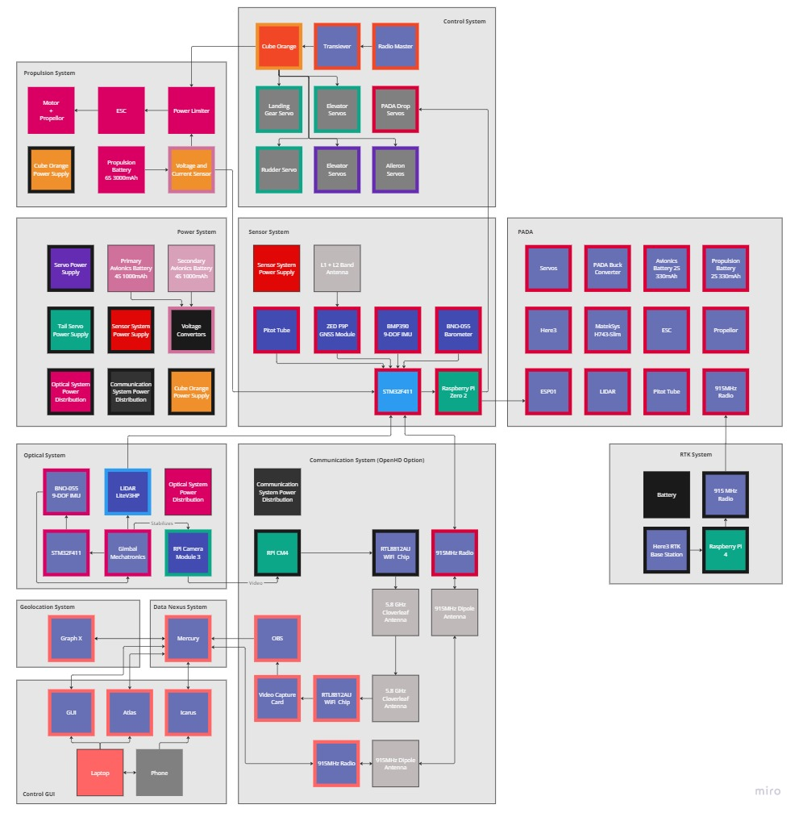

### other stuff i did
aside from my role as technical lead or whatever, i've done my fair share of technical work, including:
- fixing signal parsing issues in the 2020 design that lead to a 5x speedup
- iterating on the 2020 system to replace cellular data with a radio system for robustness and the removal of the phone from the system
- performing simulations in python to estimate drop accuracy 
- conceptualizing and implementing our main computer vision algorithm, (https://github.com/nullcline/vision)
- selection of sensors and camera to meet our system requirements 
- creating the sensor board used for our data collection, which included an IMU, barometer, and GPS
- setting up python code on a raspberry pi for reading the sensorboard, camera
- setting up python code on a raspberry pi for ZMQ based pub-sub data communication with the ground
- refactoring the raspberry pi code to use a state machine and a cleaner API for future modification
- setting up linux drivers for rtl8812au wifi cards and setting up directional antennas to perform range tests 
- a lot of system integration
- setting up drones with sensing capabilities to collect ground-truth data for software teams
- designing routing PCBs to clean up wiring of all electronics
- helping design and assemble sensor hub PCBs and power electronics
- way too many presentations (won 1st place once!)

#### random pics
i didn't take good pictures for most of this, it takes way longer to make things look good. i prioritize for making things work > making things fast > making things pretty. here are some of the pictures i could find: 

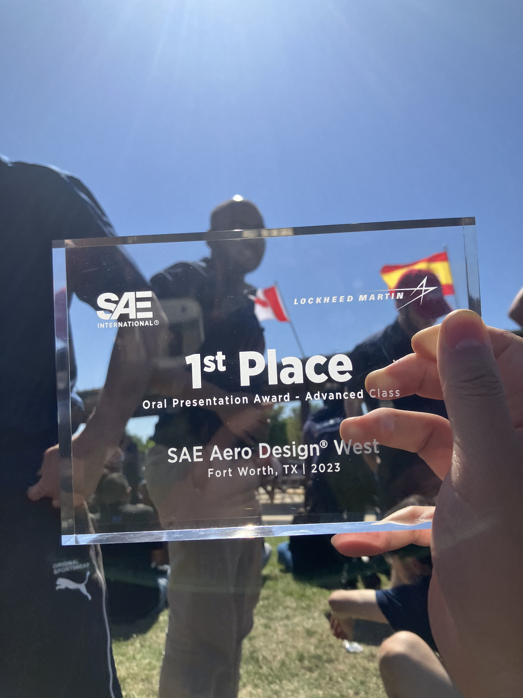
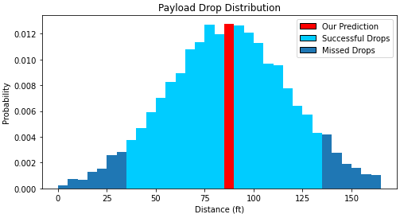
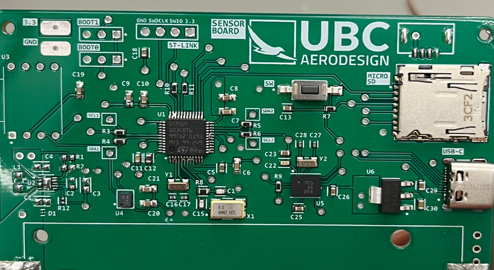
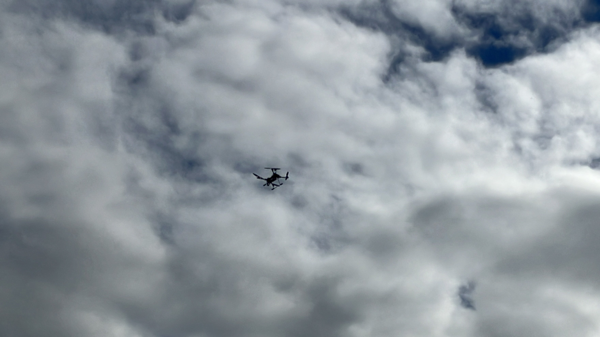
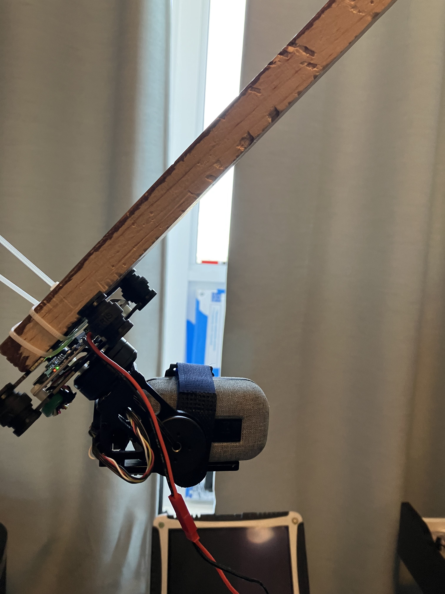

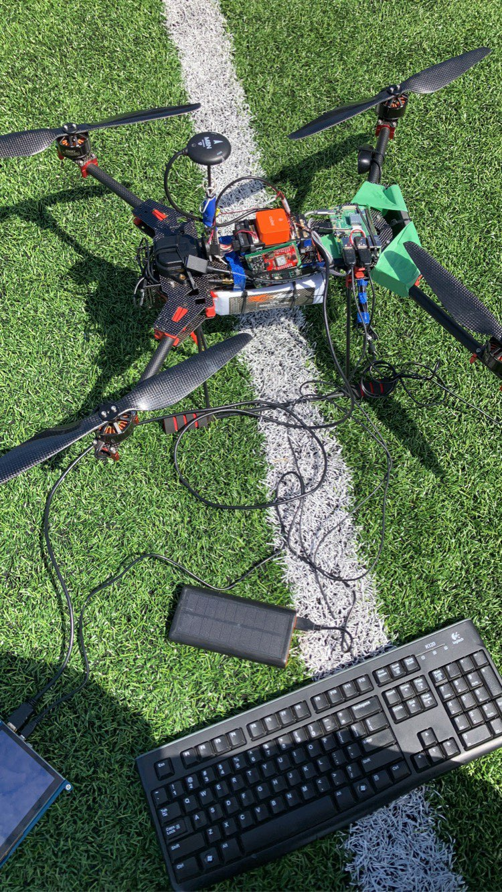

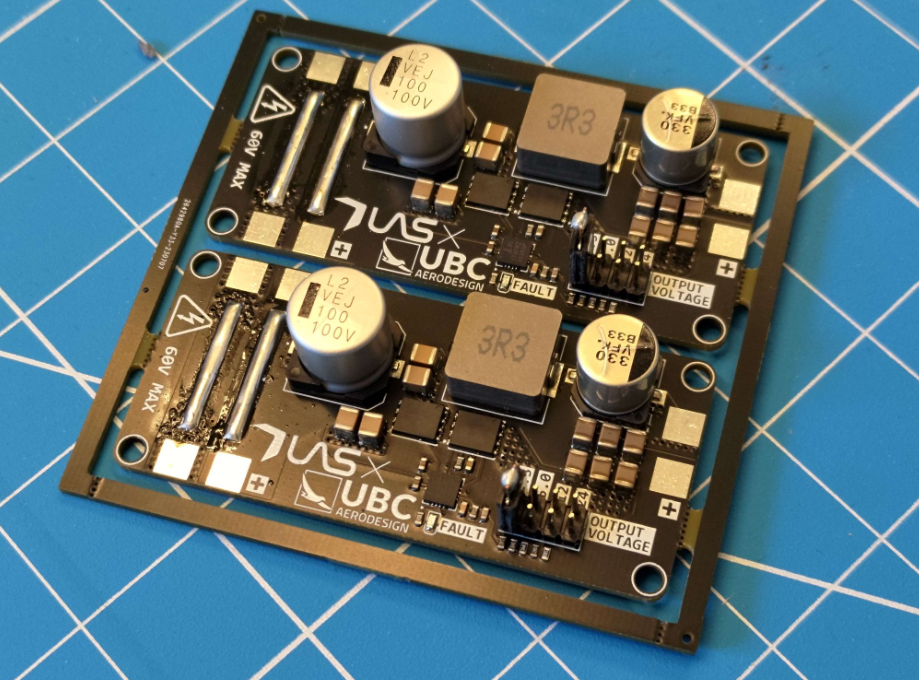
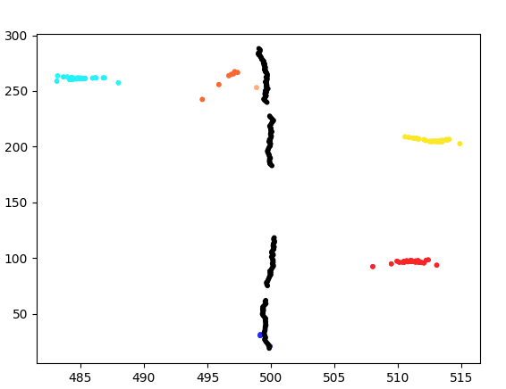
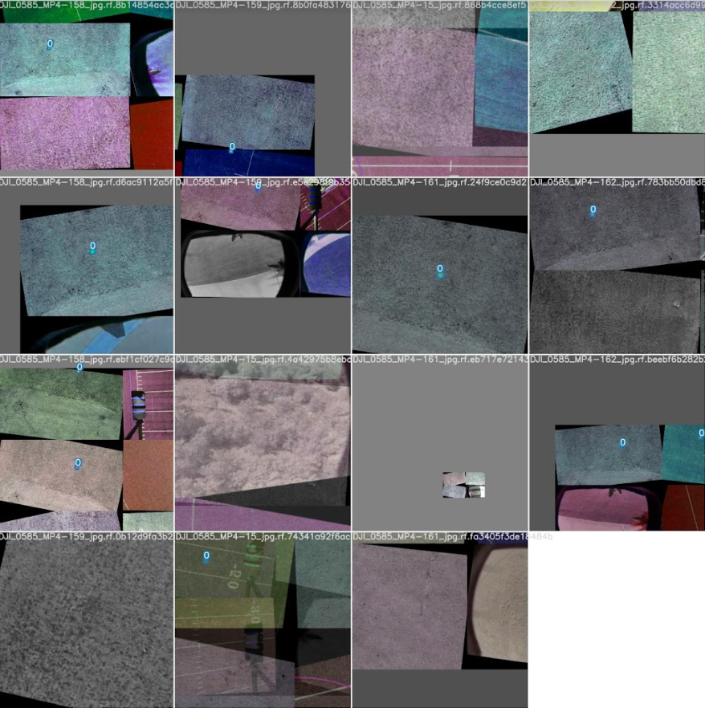
